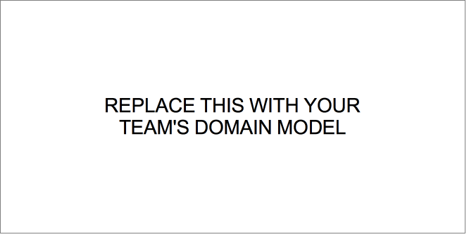

# PROJECT Design Documentation

> _The following template provides the headings for your Design
> Documentation. As you edit each section make sure you remove these
> commentary 'blockquotes'; the lines that start with a > character
> and appear in the generated PDF in italics._

## Team Information
* Team name: Juice Box Squad
* Team members
* Sergio Mercado Nunez
* Jay Lee
* Joseph DeSimone
* Khoi Pham
* Bryant Cheng

## Executive Summary

The UFund Orphanage Project is a website in which a user can fund the needs of a Orphan. 

### Purpose
The purpose of this project is to create a website in which orphan needs can be bought by a helper. The project objective is to create a robust website that has minimum errors, the administrator can create and change different needs that the meet what the orphan needs actually are.

### Glossary and Acronyms
| Term | Definition 				 |
|------|------------				 |
| SPA | Single Page 				 |
| FB  |Fund Basket  				 |
| N   |Need         				 |
| FE  |Front End    				 |
| API |Application Programing Interface  |
| UI  |User Interface  			 |
| H   |Helper		                  |

## Requirements

This section describes the features of the application.

> _In this section you do not need to be exhaustive and list every
> story. Focus on top-level features from the Vision document and
> maybe Epics and critical Stories._

### Definition of MVP
> The Minimum Viable Product in the perspective of the Admin and the Helper, The Admin must be able to log in and view,add,remove and edit the needs in the cupboard. A helper must be able to log in, view, add and remove needs to shopping cart, checkout shopping cart, search specific needs by id and name. 
### MVP Features
> _**[Sprint 4]** Provide a list of top-level Epics and/or Stories of the MVP._

### Enhancements
> _**[Sprint 4]** Describe what enhancements you have implemented for the project._

## Application Domain

This section describes the application domain.

> _**[Sprint 2 & 4]** Provide a high-level overview of the domain for this application. You
> can discuss the more important domain entities and their relationship
> to each other._
A helper can choose from Orphan needs(Cupboard) 
Orphan Needs are stored in the Inventory
Checkout Updates Inventory
Admin can Add/remove/edit shopping cart
A helper is a User 
A helper can view/edit their shopping cart. A Helper can pay to checkout their shopping cart
User can log in using a Username
User can View Website
Website displays Orphan Needs(Cupboard)
Shopping Cart(Funding Basket) proceeds to checkout
Username saves in a UserFile
The UserFile restores the ShoppingCart
Products(Needs) has Food and Supplies
Donations have Food, Money Donations, Supplies
Both Products(needs) and Donations are stored in Statics Page.

## Architecture and Design

This section describes the application architecture.

### Summary

The following Tiers/Layers model shows a high-level view of the webapp's architecture.
**NOTE**: detailed diagrams are required in later sections of this document. (_When requested, replace this diagram with your **own** rendition and representations of sample classes of your system_.)

The web application, is built using the Model–View–ViewModel (MVVM) architecture pattern.

The Model stores the application data objects including any functionality to provide persistance.

The View is the client-side SPA built with Angular utilizing HTML, CSS and TypeScript. The ViewModel provides RESTful APIs to the client (View) as well as any logic required to manipulate the data objects from the Model.

Both the ViewModel and Model are built using Java and Spring Framework. Details of the components within these tiers are supplied below.

### Overview of User Interface

This section describes the web interface flow; this is how the user views and interacts with the web application.

> _Provide a summary of the application's user interface. Describe, from the user's perspective, the flow of the pages in the web application._

### View Tier
> _**[Sprint 4]** Provide a summary of the View Tier UI of your architecture.
> Describe the types of components in the tier and describe their
> responsibilities. This should be a narrative description, i.e. it has
> a flow or "story line" that the reader can follow._

> _**[Sprint 4]** You must provide at least **2 sequence diagrams** as is relevant to a particular aspects
> of the design that you are describing. (**For example**, in a shopping experience application you might create a
> sequence diagram of a customer searching for an item and adding to their cart.)
> As these can span multiple tiers, be sure to include an relevant HTTP requests from the client-side to the server-side
> to help illustrate the end-to-end flow._

> _**[Sprint 4]** To adequately show your system, you will need to present the **class diagrams** where relevant in your design. Some additional tips:_
>* _Class diagrams only apply to the **ViewModel** and **Model** Tier_
>* _A single class diagram of the entire system will not be effective. You may start with one, but will be need to break it down into smaller sections to account for requirements of each of the Tier static models below._
>* _Correct labeling of relationships with proper notation for the relationship type, multiplicities, and navigation information will be important._
>* _Include other details such as attributes and method signatures that you think are needed to support the level of detail in your discussion._

### ViewModel Tier
> _**[Sprint 4]** Provide a summary of this tier of your architecture. This
> section will follow the same instructions that are given for the View
> Tier above._

> _At appropriate places as part of this narrative provide **one** or more updated and **properly labeled**
> static models (UML class diagrams) with some details such as critical attributes and methods._
>

### Model Tier
> _**[Sprint 2, 3 & 4]** Provide a summary of this tier of your architecture. This
> section will follow the same instructions that are given for the View
> Tier above._

The three main classes we built to model our website are the User, the Product, and the Shopping Cart.
The User class was built to maintain all of the information pertaining to each user, such as their username and password. This allows them to log into their account as needed in order to fulfill their personal tasks and maintain persistence when logging in and out.
The Product class was built to maintain information pertaining to each need inside the cupboard. This allows the controller to access information about each product’s id, cost, quantity, and name. This allows transparency for when the Admin or a Helper attempts to create, search for, edit, or delete a need if they’re permitted to.
The Shopping Cart class was built to allow Helpers to add needs to a Fund Basket, so they can have them all in one place for when they checkout. Helpers have the ability to both add and remove needs from the cart as well as check the cart of needs out.

> _At appropriate places as part of this narrative provide **one** or more updated and **properly labeled**
> static models (UML class diagrams) with some details such as critical attributes and methods._
>

## OO Design Principles
> _**[Sprint 2, 3 & 4]** Will eventually address upto **4 key OO Principles** in your final design. Follow guidance in augmenting those completed in previous Sprints as indicated to you by instructor. Be sure to include any diagrams (or clearly refer to ones elsewhere in your Tier sections above) to support your claims._
Low Coupling: 
The way the JuiceBoxSquad implemented Low coupling was by creating classes that were reliant on themselves to the best of their ability, only have linked items from API to UI, Even that was kept to a minimum
Information Expert:
The way the JuiceBoxSquad implemented information Expert was by not creating multiple classes for different operations, we kept similar items together. 
> _**[Sprint 3 & 4]** OO Design Principles should span across **all tiers.**_

## Static Code Analysis/Future Design Improvements
> _**[Sprint 4]** With the results from the Static Code Analysis exercise,
> **Identify 3-4** areas within your code that have been flagged by the Static Code
> Analysis Tool (SonarQube) and provide your analysis and recommendations.
> Include any relevant screenshot(s) with each area._

> _**[Sprint 4]** Discuss **future** refactoring and other design improvements your team would explore if the team had additional time._

## Testing
> _This section will provide information about the testing performed
> and the results of the testing._

### Acceptance Testing
> _**[Sprint 2 & 4]** Report on the number of user stories that have passed all their
> acceptance criteria tests, the number that have some acceptance
> criteria tests failing, and the number of user stories that
> have not had any testing yet. Highlight the issues found during
> acceptance testing and if there are any concerns._
Acceptance Testing was performed by our own team members, the unit tests were run in order to make sure there was functionality. Some of the feature that were wanted to be implemented were not, so they failed by default.

### Unit Testing and Code Coverage
Unit Tests worked on each class individually but when time came to combine all of the classes a lot of the classes had to changed inorder to function together properly and they will rewritten having these changes in mind. As for Code Coverage the team has not yet touched code Coverage hopefully for sprint 3 the juicebox squad can have it completed. 
> _**[Sprint 4]** Discuss your unit testing strategy. Report on the code coverage
> achieved from unit testing of the code base. Discuss the team's
> coverage targets, why you selected those values, and how well your
> code coverage met your targets._

>_**[Sprint 2 & 4]** **Include images of your code coverage report.** If there are any anomalies, discuss
> those._

