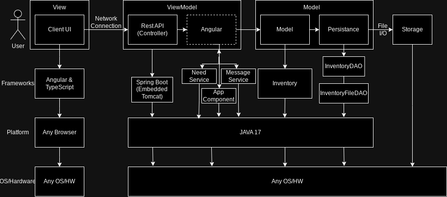

# PROJECT Design Documentation

Team Coordinator = Joseph DeSimone, Requirement Coordinator = Sergio Mercado Nunez, Design Coordinator = Khoi ,Configuration Coordinator = Jay Lee , Quality and Testing Coordinator = Bryant 

## Team Information
* Team name: Juice Box Squad
* Team members
* Sergio Mercado Nunez
* Jay Lee
* Joseph DeSimone
* Khoi Pham
* Bryant Cheng

## Executive Summary
The UFund Orphanage Project is a dedicated website designed to connect individuals with the opportunity to make a meaningful impact in the lives of orphans. Through this platform, users have the ability to provide crucial financial support to fulfill the diverse needs of these children, ensuring they receive the care, resources, and opportunities essential for their well-being and future growth.

### Purpose
The purpose of this project is to create a website in which orphan needs can be bought by a helper. The project objective is to create a robust website that is fully functional, easy to use. The administrator can create and update the needs to where they are always aligned with the orphans necessities. 

### Glossary and Acronyms
| Term | Definition 				 |
|------|------------				 |
| SPA |Single Page 				 |
| FB  |Funding Basket  			 |
| FE  |Front End    				 |
| BE  |Back End                          |
| API |Application Programing Interface  |
| UI  |User Interface  			 |
| H   |Helper		                  |

## Requirements
The requirements of this web application are to have the following functioning features:
-Username, password to create and save accounts and determine the difference between user and admin.
-Admin can create, delete and modify needs in the Cupboard
-User can add, remove from FB.
-Each User can click on their profile
-Banner Ads in order to generate revenue on the website.
-
### Definition of MVP
> The Minimum Viable Product in the perspective of the Admin and the Helper, The Admin must be able to log in and view,add,remove and edit the needs in the cupboard. A helper must be able to log in, view, add and remove needs to shopping cart, checkout shopping cart, search specific needs by id and name. 

### MVP Features
> Top-level Epics and/or Stories 
-Helper Actions
	-Helper adds to FB
	-Helper pays FB
-Admin Actions
	-Admin Adds to Cupboard
	-Admin Edits Inventory
-User
	-User Creates Account
	-User Logs into Username
-10 % Feature 
	-Banner Ads
	-Profile Page

### Enhancements
> Describe what enhancements you have implemented for the project.
Banner Ads - As a helper, I want to view banner ads of needs so that I can easily find another way to help support orphans

Statistics Page - As an admin, I want to be able to see the numerical data of the donations so that I can track how much is being donated and at what rate

## Application Domain

> can discuss the more important domain entities and their relationship
> to each other._

A user, referred to as a helper, has the option to select items from the Orphan Needs category, specifically the Cupboard section. These Orphan Needs are cataloged in the inventory. Upon checkout, the inventory is updated.

Administrators have the authority to add, remove, or edit items in the shopping cart. The term "helper" is synonymous with "user" in this context. Helpers can not only view but also edit their shopping cart, and they can make payments to finalize and check out their selected items.

To access the system, users can log in using a unique username and password. Once logged in, they can navigate through the website, where information about Orphan Needs from the Cupboard is visibly displayed.

The shopping cart, also referred to as the Funding Basket, can be reviewed before proceeding to checkout. Usernames are stored in a designated UserFile, facilitating the restoration of the shopping cart for future reference.

The items within the system are categorized as "Needs" and encompass both Food and Supplies. Donations, which include Food, Money Donations, and Supplies, are also part of the system. Both Needs and Donations are centralized and stored on the Statistics Page.

## Architecture and Design

This section describes the application architecture.

### Summary

The following Tiers/Layers model shows a high-level view of the webapp's architecture.
**NOTE**: detailed diagrams are required in later sections of this document. (_When requested, replace this diagram with your **own** rendition and representations of sample classes of your system_.)

The web application is built using the Model–View–ViewModel (MVVM) architecture pattern.

The Model stores the application data objects including any functionality to provide persistence.

The View is the client-side SPA built with Angular utilizing HTML, CSS and TypeScript. The ViewModel provides RESTful APIs to the client (View) as well as any logic required to manipulate the data objects from the Model.

Both the ViewModel and Model are built using Java and Spring Framework. Details of the components within these tiers are supplied below.

### Overview of User Interface

This section describes the web interface flow; this is how the user views and interacts with the web application.

> _Provide a summary of the application's user interface. Describe, from the user's perspective, the flow of the pages in the web application._

### View Tier
> _**[Sprint 4]** Provide a summary of the View Tier UI of your architecture.
> Describe the types of components in the tier and describe their
> responsibilities. This should be a narrative description, i.e. it has
> a flow or "story line" that the reader can follow._

> _**[Sprint 4]** You must provide at least **2 sequence diagrams** as is relevant to a particular aspects
> of the design that you are describing. (**For example**, in a shopping experience application you might create a
> sequence diagram of a customer searching for an item and adding to their cart.)
> As these can span multiple tiers, be sure to include an relevant HTTP requests from the client-side to the server-side
> to help illustrate the end-to-end flow._

> _**[Sprint 4]** To adequately show your system, you will need to present the **class diagrams** where relevant in your design. Some additional tips:_
>* _Class diagrams only apply to the **ViewModel** and **Model** Tier_
>* _A single class diagram of the entire system will not be effective. You may start with one, but will be need to break it down into smaller sections to account for requirements of each of the Tier static models below._
>* _Correct labeling of relationships with proper notation for the relationship type, multiplicities, and navigation information will be important._
>* _Include other details such as attributes and method signatures that you think are needed to support the level of detail in your discussion._

### ViewModel Tier
> _**[Sprint 4]** Provide a summary of this tier of your architecture. This
> section will follow the same instructions that are given for the View
> Tier above._

> _At appropriate places as part of this narrative provide **one** or more updated and **properly labeled**
> static models (UML class diagrams) with some details such as critical attributes and methods._
>

### Model Tier
> _**[Sprint 2, 3 & 4]** Provide a summary of this tier of your architecture. This
> section will follow the same instructions that are given for the View
> Tier above._

The three main classes we built to model our website are the User, the Product, and the Shopping Cart.
The User class was built to maintain all of the information pertaining to each user, such as their username and password. This allows them to log into their account as needed in order to fulfill their personal tasks and maintain persistence when logging in and out.
The Product class was built to maintain information pertaining to each need inside the cupboard. This allows the controller to access information about each product’s id, cost, quantity, and name. This allows transparency for when the Admin or a Helper attempts to create, search for, edit, or delete a need if they’re permitted to.
The Shopping Cart class was built to allow Helpers to add needs to a Fund Basket, so they can have them all in one place for when they checkout. Helpers have the ability to both add and remove needs from the cart as well as check the cart of needs out.

> _At appropriate places as part of this narrative provide **one** or more updated and **properly labeled**
> static models (UML class diagrams) with some details such as critical attributes and methods._
>

## OO Design Principles
> _**[Sprint 2, 3 & 4]** Will eventually address upto **4 key OO Principles** in your final design. Follow guidance in augmenting those completed in previous Sprints as indicated to you by the instructor. Be sure to include any diagrams (or clearly refer to ones elsewhere in your Tier sections above) to support your claims._

Low Coupling: 
As a team the group will be using the principle of low coupling, which is keeping the design to keep the number of unnecessary relationships down. The way the team will be implementing this low coupling concept is by using well-defined interfaces between classes so that the classes don't know about each other. Because if they know about each other then if we affect one of the classes it will affect the other and can cause it to break other code.  Another way the team will implement low coupling is by avoiding sharing data between the classes. In order to be able to implement different classes without them affecting each other. Abstract classes are another way for the team to reduce coupling. Using abstract classes allows classes to be implemented differently without affecting each other.

Open/Closed:
What Open/closed means is that new functionality can be added with minimum changes to existing code. A way the JuiceBoxSquad has designed code that keeps in mind these principles that make it easier to change is in the example of needs. When adding a new parameter to needs instead of adding the parameter anywhere, we always put it at the end so the least amount of code needs to be changed everywhere where needs is referenced.

Law of Demeter:
We applied the Law of Demeter through separating the ability to view certain entities based on which role you log in as.  For example, if you’re the Admin of the website, you cannot peer into the Helper’s shopping cart.  In fact, any given Helper cannot peer into any other Helper’s shopping cart either.  On the other hand, Helpers also cannot look at all of the data the Admin gets to look at, namely the inventory data.  That way, there’s a level of privacy added through separating the views of each role. The Law of Demeter also states that these types of models are easier to maintain since removing one entity doesn’t require you to make changes throughout all of the removed entity’s connected entities.  Obviously there’s a lot of polishing we can do for this diagram, but it serves its purpose to observe how different entities interact with each other for the most part.

Controller:
Our current model accounts for the ability to perform simple tasks by separating the concerns of each entity at each level.  For example, we will be adding a controller that checks the username the user entered upon startup of the website in relation to the database with usernames and account information.  As another example, we will allow the Admin of the website to add, remove, and edit Needs in the Cupboard.  And the Cupboard will have direct access to the overall inventory of the organization, so it can add, remove, and edit the inventory based on what the admin desires to alter about it.  In a similar way, Helpers will be able to pass shopping carts full of donations for Needs to the Checkout, which will then process all the new items that must be accounted for in the inventory after the transaction is approved.

Single-responsibility:
Single responsibility is a computer programming principle, part of the bigger SOLID framework, which is pertinent in its philosophy that a class should only have one reason to change. The concepts underlying the principle is quite explanatory in that each constructed class in the universal model diagram (UML) should be influenced by one external influence and only one. Single-responsibility principle is utilized in my group’s design because every class entity has only one major responsibility that needs to be addressed per interaction with another class entity. For example, the helper class has only one function with the needs cupboard class, which is to choose from it. The helper class also has only one function with the shopping cart class, which is to edit its content. What the helper class cannot do is add to or remove from the shopping cart the items that it chose from the needs cupboard. That task is solely done by the needs cupboard class. By doing so, this ensures that the system of classes each only has one singular responsibility when an individual class interacts with other classes.

Information Expert:
Information expert is the idea of keeping the most qualified class which means the class that has the most information about a certain area of code to fulfill a certain  responsibility. The way the JuiceBoxSquad implemented information Expert was by not creating multiple classes for different operations, we kept similar items together.

## Static Code Analysis/Future Design Improvements
> _**[Sprint 4]** With the results from the Static Code Analysis exercise,
> **Identify 3-4** areas within your code that have been flagged by the Static Code
The Bot area of the is not covered therefore it is flagged by the static code. This is an area we must improve on for sprint 4. Hopefully the code will be converted. 
> Analysis Tool (SonarQube) and provide your analysis and recommendations.
> Include any relevant screenshot(s) with each area._

> Update CSS/Front end, how the perceived looks of the website look alot better. 

## Testing
> _This section will provide information about the testing performed
> and the results of the testing._

### Acceptance Testing
> _**[Sprint 2 & 4]** Report on the number of user stories that have passed all their
> acceptance criteria tests, the number that have some acceptance
> criteria tests failing, and the number of user stories that
> have not had any testing yet. Highlight the issues found during
> acceptance testing and if there are any concerns._
Acceptance Testing was performed by our own team members, the unit tests were run in order to make sure there was functionality. Some of the features that were wanted to be implemented were not, so they failed by default.

### Unit Testing and Code Coverage
Unit Tests worked on each class individually but when time came to combine all of the classes a lot of the classes had to change inorder to function together properly and they will be rewritten having these changes in mind. As for Code Coverage the team has not yet touched code Coverage. Hopefully for sprint 3 the juicebox squad can have it completed. 
> _**[Sprint 4]** Discuss your unit testing strategy. Report on the code coverage
> achieved from unit testing of the code base. Discuss the team's
> coverage targets, why you selected those values, and how well your
> code coverage met your targets._

>_**[Sprint 2 & 4]** **Include images of your code coverage report.** If there are any anomalies, discuss
> those._

